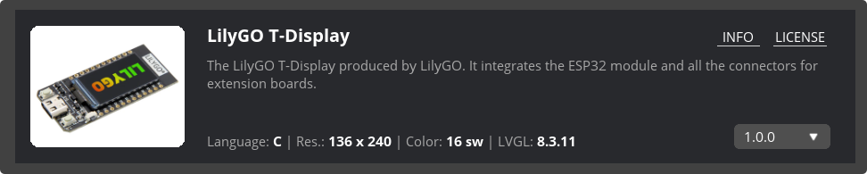

# Custom-Board
----

> [SquareLine在线文档](https://docs.squareline.io/docs/obp/)

## 自定义文件夹

### 导入位置

Windows: `C:\Users\user-name\SquareLine\boards\Espressif`

### 文件夹结构

```txt
SquareLine_Studio
└── boards
    └── your_board_name
        └── version (v1_0_0)
            ├── your_board.png
            ├── your_board.zip
            └── your_board.slb
```

### 前端显示

## 自定义文件夹详情



### 图像

> 用于前端面板展示

尺寸: 380x300px
文件类型: PNG, 24 bi

### slb文件

> json格式文件

```json
{
    "version":"v1.0.0",
    "group":"SquareLine Studio, LVGL",
    "title": "SLS Board for freeRTOS",
    "keywords": "SLS, freeRTOS, Simulator",
    "width": 480,
    "height": 272,
    "min_width": 16,
    "min_height": 16,
    "max_width": 2048,
    "max_height": 2048,
    "offset_x": 0,
    "offset_y": 0,
    "rotation": 0,
    "shape": "rectangle",
    "color_depth": "16",
    "lvgl_export_path": "packages/LVGL-latest/",
    "lvgl_include_path": "lvgl.h",
    "supported_lvgl_version": "8.2.0, 8.3.2",
    "pattern_match_files": "applications/lvgl/lv_conf.h",
    "language":"C",
    "ui_export_path":"./applications/lvgl/squareline/ui/",
    "url":"https://squareline.io",
    "short_description": "short description",
    "long_description": "long description"
}
```

- INFO       ->     url  可放git仓库路径
    - `"url": "https://github.com/changzhen976/changzhen976-SquareLine-Custom-Board"`
- LICENSE  ->     repository  点击前端页面`LICENSE`会跳转repository后加`/LICENSE`跳转获取许可
    - `"repository": "https://github.com/changzhen976/SquareLine-Custom-Board/blob/main"`

### zip压缩包

> 压缩包为例程文件, 当导出工程时会将ui文件导出至 slb 中指定的`ui_export_path`中, 推荐`./main/ui`

> 工程为标准IDF工程, ui文件夹留空供SquareLine导出代码

#### 代码调用

在Main中初始化LVGL后通过调用`ui_init()`调用生成的代码

```c
void app_main(void)
{   
    LVGL_SPI_initFunc();

    ui_init();
    
    ...  
}
```

#### 工程设置注意事项

1. 工程文件夹名称需要修改为`__ui_project_name__`
2. 工程顶层`CMakeLists.txt`文件将项目名称也需改为`__ui_project_name__`

> 当工程导出时, 会将`__ui_project_name__`替换为SquareLine工程名称

> 其他类型关键字
>  `__UI_PROJECT_NAME__`
>   `__UI_PROJECT_HOR_RES__`
>   `__UI_PROJECT_VER_RES__`
>   `__UI_PROJECT_COLOR_DEPTH__`
>   `__UI_PROJECT_COLOR_16_SWAP__`
>   `__UI_LVGL_VERSION_MAJOR__`
>   `__UI_LVGL_VERSION_MINOR__`