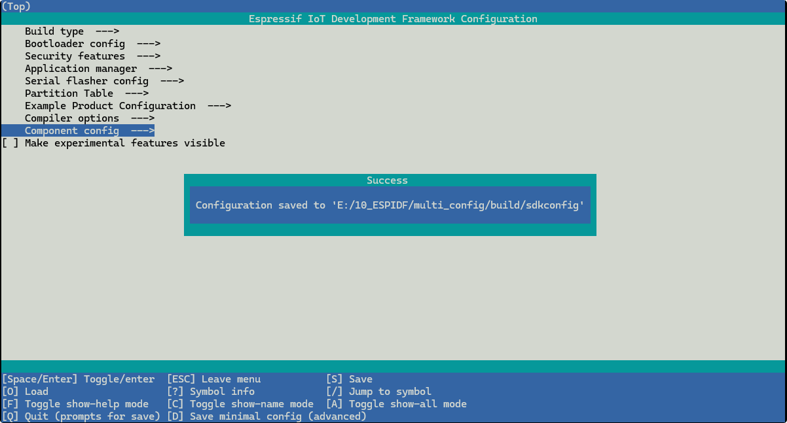

# Configure

----

## What is Menuconfig

> [kconfig-reference Online](https://docs.espressif.com/projects/esp-idf/en/latest/esp32/api-reference/kconfig-reference.html)


### Where to Config

#### 1 In cmd window

```shell
idf.py menuconfig
```


#### 2 In VS Code extention

```shell
>ESP-IDF:SDK Configuration Editor(Menuconfig)
```


#### 3 config saved path

`'project-path'/build/sdkconfig`



## What is Menuconfig


## How to Write

### Kconfig.projbuild

#### An example

Located in Main folder, it config project property

```kconfig
menu "Example Product Configuration"

    config EXAMPLE_PRODUCT_NAME
        string "Product name"
        default "Not set"
        help
            Product name used in the example

    choice EXAMPLE_FUNC_IMPL
        prompt "Implementation of function 'func'"
        help
            Select one of the implementations of 'func' to be used in the app.
            This setting is used in component CMakeLists.txt.

        config EXAMPLE_FUNC_IMPL_DEV
            bool "Development (func_dev.c)"
        config EXAMPLE_FUNC_IMPL_PROD
            bool "Production (func_prod.c)"
    endchoice
endmenu
```


#### Format

##### Menu

```
menu "menuString"  
    ...
endmenu
```  

It will display in SdkConfig Editor


##### Option

```
config SOME_CFG_KEY_WORD    
    string "string key word" / Bool / some else    ' cfg data type

```
Once Configed, a key word will be seved in `sdkconfig` as `CONFIG_SOME_CFG_KEY_WORD`


##### Choice

```
choice EXAMPLE_FUNC_IMPL
    prompt "Implementation of function 'func'"
    help
        Select one of the implementations of 'func' to be used in the app.
        This setting is used in component CMakeLists.txt.

    config EXAMPLE_FUNC_IMPL_DEV
        bool "Development (func_dev.c)"
    config EXAMPLE_FUNC_IMPL_PROD
        bool "Production (func_prod.c)"
endchoice
```


### build/sdkconfig

```
#
# Example Product Configuration
#
CONFIG_EXAMPLE_PRODUCT_NAME="Blinky Development Test01"
# CONFIG_EXAMPLE_FUNC_IMPL_DEV is not set
CONFIG_EXAMPLE_FUNC_IMPL_PROD=y
# end of Example Product Configuration

```