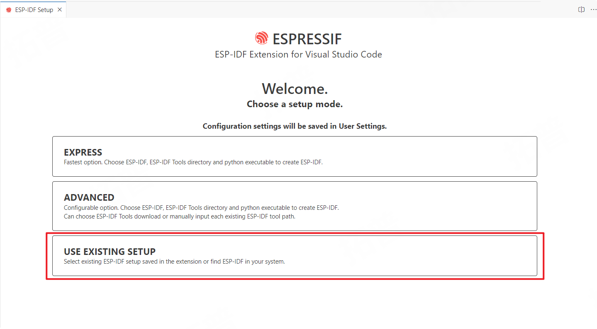
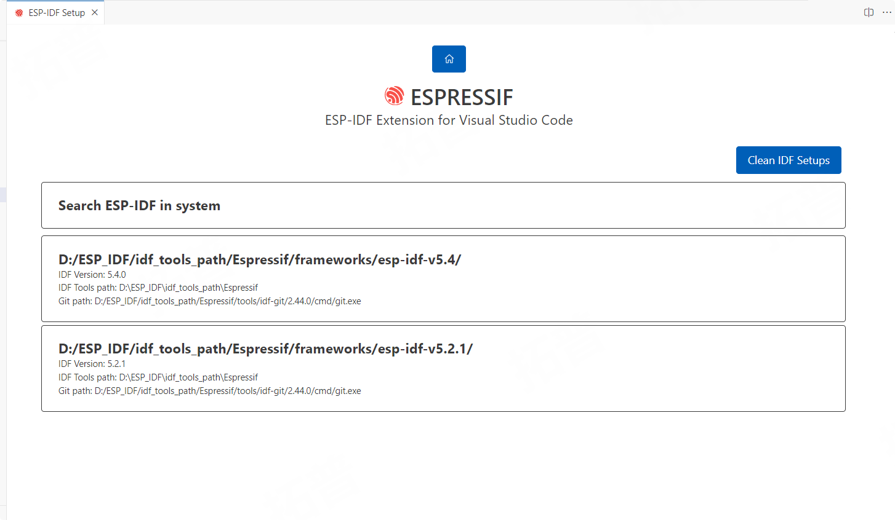
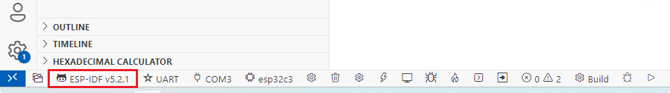
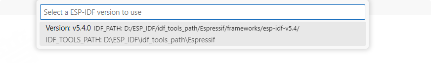

# IDF多版本切换

----

> 本地已安装多个版本IDF, 且正常运行

## 插件配置

> `View`-> `Command Palette...` -> `>ESP-IDF: Configure ESP-IDF Extension`

导入本地idf工具链

发现有多个版本idf(推荐各工具链安装在相同路径下)

> 两个都要安装一下(方便直接点击版本图标切换版本)
> 如果刷新不出来, 将插件设置里的path参数清除掉, 重启VSCode重新启动插件配置

## 工程版本切换

### 清除中间文件

1. Full Clean 清除build文件夹及其他缓存文件
2. 删除`dependencies.lock`, 里面包含idf版本指定, 切换版本编译会报错

### 快捷切换IDF版本

点击坐下角IDF插件提供的快捷开关

弹窗可选择其他版本

