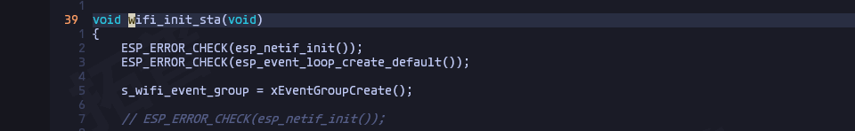
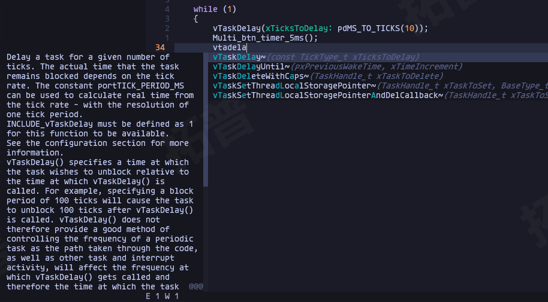

# 配置nvim作为IDF IDE

----

> linux平台编译速度要远快于Windows平台
> Windows支持wsl创建Linux子系统, 在Windows平台下使用Linux变得十分简单(如何安装wsl请自行搜索)
> 在Windows宿主机中使用VSCode远程到wsl中是更方便易用的方法, 配置更加简单. 使用vim开发略显费力, 但是显得炫酷
> nvim配置前应确保 linux中已安装ESP-IDF且可正常编译

## 安装esp-clang

命令行中运行一下命令, 安装ESP clang lsp

```shell
idf_tools.py install esp-clang
```

## nvim插件配置

### coc插件安装

> 使用`VimPlug`管理插件

安装`coc.nvim`, 使用其`coc-clangd`连接lsp服务负责代码补全查看等功能

```lua
vim.call('plug#begin')
    
Plug('neoclide/coc.nvim', {['branch'] = 'release'})
    
vim.call('plug#end')
```

重启nvim, 命令行输入`:PlugInstall`安装插件

### 安装coc插件

> coc拥有自己的插件库, 可以通过coc命令直接安装

`coc.nvim`安装完成后, 安装coc插件`coc-clangd`

nvim运行命令 `:CocInstall coc-clangd`

### 插件验证

新建一个 Linux C 工程

```c
#include <pthread.h>
#include <stdio.h>
#include <unistd.h>

void *thread_function(void *arg) {
    char *message = (char *)arg;
    for (int i = 0; i < 3; ++i) {
        printf("%s: count %d\n", message, i);
        sleep(1);
    }
    return NULL;
}

int main() {
    pthread_t thread1, thread2;
    const char *msg1 = "thread_1";
    const char *msg2 = "thread_2";

    if (pthread_create(&thread1, NULL, thread_function, (void *)msg1) != 0) {
        perror("create thread1 fail!");
        return 1;
    }

    if (pthread_create(&thread2, NULL, thread_function, (void *)msg2) != 0) {
        perror("create thread2 fail!");
        return 1;
    }

    pthread_join(thread1, NULL);
    pthread_join(thread2, NULL);

    printf("main thread: all threads end.");
    return 0;
}
```

命名为`thread_test.c`, 该代码调用了pthread相关的函数.

>保存后可使用`gcc thread_test.c -o thred_test -lpthread`编译

将光标移动至19行`pthread_create()`上, 按下`<shift-K>`, 会显示光标所在函数的信息, 按下`gd`可跳转至函数定义


> coc插件的快捷键设置可复制其代码库中的[例子](https://github.com/neoclide/coc.nvim?tab=readme-ov-file#example-lua-configuration)

正常显示函数信息, 可正常跳转表示coc clangd安装成功

## IDF工程目录配置

> IDF工程使用了其专有的编译器, 所以默认的linux平台gcc编译器无法正确识别工程代码中的函数与定义, 会导致显示非常多的警告与错误

### 设置coc局部配置

> 为了不影响其他项目代码正常查看和编译(尤其是该系统同时用于开发Linux C 代码), 为IDF项目设置局部的配置更加合理
> coc的局部配置文件位于当前工作文件夹下的`./.vim/coc-settings.json`

```json
{
    "calngd.path" :"/home/user01/.espressif/tools/esp-clang/16.0.1-fe4f10a809/esp-clang/bin/clangd",
    "clangd.arguments": [
        "--background-index",
        "--compile-commands-dir=${workspaceFolder}",
        "--completion-style=detailed",
        "--header-insertion=never",
        "--query-driver=/home/user01/.espressif/tools/xtensa-esp-elf/esp-13.2.0_20230928/xtensa-esp-elf/bin/xtensa-esp32-elf-gcc"
    ]
}
```

`calngd.path`为刚刚安装的esp-clang路径
`--query-driver`为idf的gcc路径(可选, 因为不同芯片使用了不同的gcc)

将该配置文件保存, 重启nvim (**nvim需要在项目根目录启动**)

打开代码, 会出现一些报错(Unknown argument)


所以还需要后续配置

### 配置.clangd文件

> `.clangd`文件中配置了当前文件夹下的clangd属性, 可用来减少报错

在项目根目录新建`.clangd`文件, 将报错参数写入:

```yaml
CompileFlags :
  Remove: [-fno-tree-switch-conversion, -fno-shrink-wrap, -fstrict-volatile-bitfields, -mlongcalls]
```

### tags & compile_commands.json

为了更好的实现工程内的跳转(查看变量和函数定义, 查找引用等)
需要`tags`文件和`compile_commands.josn`文件

**tags**文件由ctag生成:

在工作文件夹中运行`ctags -R *`, 为当前目录下的所有子目录内的文件生成tags
或在nvim中运行`:Tags`生成tags文件, 有时需要重启下nvim才会生效最新tags文件

**compile_commands.json**文件由编译生成, 生成在`./build`文件夹中, 将其复制到项目根目录
将其复制到项目根目录中`cp ./build/compile_commands.json ./`

### 验证

查看文档`<Shift-K>`


跳转到定义`gd`




查看引用`gr`


函数自动补全



## 美中不足

当前配置下, `#include "freeRTOS/FreeRTOS.h"`会报出一个错误一个警告

使用`.clangd`文件包含路径也无法全部消除

```yaml

```


仅前段报错, 不影响编译