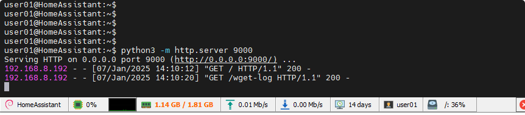

# OTA相关准备工作

# 准备工作

* 分区表：

  * 选择IDF自带的OTA分区
  * 或自定义分区
* 集成OTA代码
* 准备可拉取`.bin`​文件的服务器

  * 本地主机使用python建立临时服务器
  * 租赁网络服务器

# OTA例程工厂程序`native_ota_example`​

> 启动后自动连接 wifi 按照设定路径请求更新
>
> 需要新软件版本比当前工厂程序新

# 建立临时网络服务器，用于获取二进制文件

on linux server installed python

```shell
cd ~/esp_bin/
# navigate folder which has binary file

python -m python2 -m SimpleHTTPServer 9000
# python2

python3 -m http.server 9000
# pyton3

# then esp32 can get bin from 'http://server-IP:9000/project-name.bin'
```


# OTA所需软件

> 版本设置：[版本信息设定](OTA相关/版本信息设定.md)

拉取的二进制软件版本必须高于当前软件版本（可设置）

‍

‍

‍

‍
